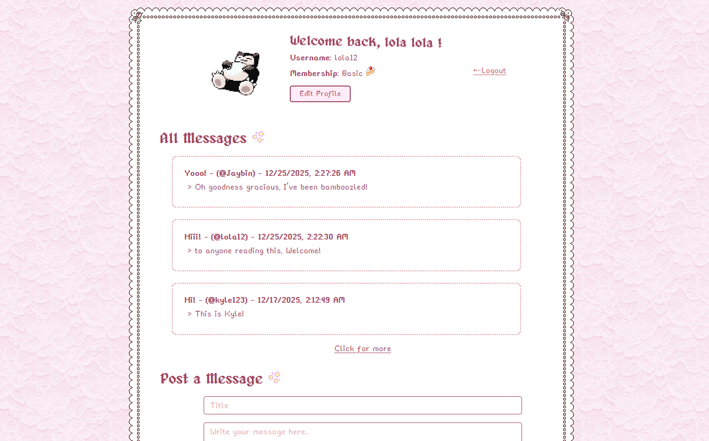

# members-only

A simple multi-user platform that allows users to create their own accounts and share messages with other users.

## Features

- User authentication with **Passport.js**
- Secure session management using **express-session**
- Sessions persisted in **PostgreSQL**
- User account creation and login
- Authenticated users can create and view messages
- Protected routes and middleware
- Server-side rendering

## Tech Stack

- **Backend**: Node.js, Express
- **Authentication**: Passport.js (Local strategy)
- **Session Management**: express-session
- **Database**: PostgreSQL
- **Session Store**: PostgreSQL (via `connect-pg-simple`)
- **ORM / Querying**: raw SQL
- **Other Tools**: dotenv, bcrypt, pg

## Authentication & Sessions

This project implements session-based authentication using Passport and Express.

- User credentials are securely hashed using **bcrypt**
- Passport manages login and authentication state
- Sessions are stored in PostgreSQL instead of memory:
  - Allows session persistence across server restarts
  - Enables horizontal scaling
- Protected routes ensure only authenticated users can access messages

## Future Improvements

- CSRF protection
- Rate limiting
- OAuth providers (Google, etc...)
- Pagination for messages
